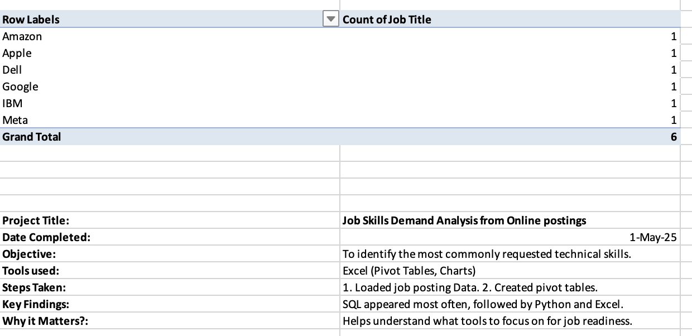
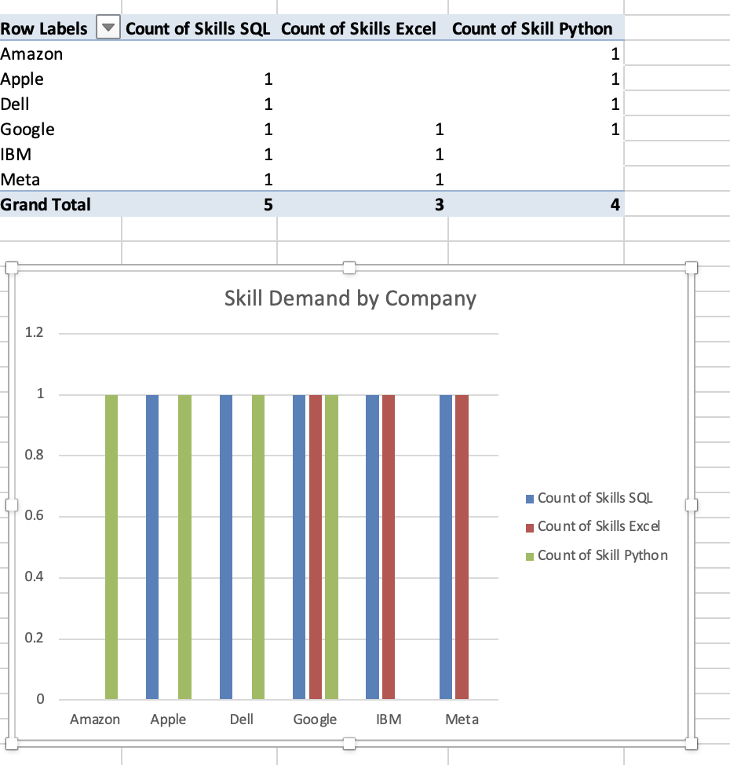
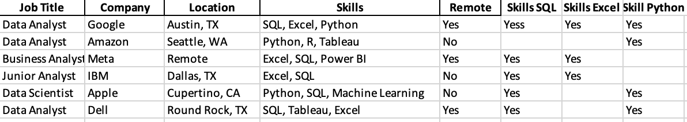

# 📊 Job Postings Analysis using Excel

## 📘 Project Overview
This project uses Microsoft Excel to explore job posting data and extract key insights about hiring trends and in-demand skills. The focus is on presenting the analysis clearly using summaries, charts, and raw data for transparency.

## 🎯 Objectives
- Understand job market trends through data
- Identify which skills are most frequently requested
- Practice Excel-based analysis and presentation

## 🛠️ Tools Used
- Microsoft Excel
- Bar/Pie Charts
- Raw Data Structuring

## 📎 Files Included
- 📄  — A write-up of the key findings
- 📊  — Visual breakdown of top skills
- 📁  — The source data used

## 📈 Key Takeaways
- Soft and technical skills are both in high demand
- Excel is a powerful tool for non-code data analysis
- Structured summaries help communicate results clearly

## 🌱 Why It Matters
This project is designed to show how even simple tools like Excel can generate professional insights. It’s a great example of analysis without code — using visual communication, structure, and storytelling to present data effectively.

MIT License

Copyright (c) 2025 Victoria Alexander

Permission is hereby granted, free of charge, to any person obtaining a copy
of this software and associated documentation files (the “Software”), to deal
in the Software without restriction, including without limitation the rights 
to use, copy, modify, merge, publish, distribute, sublicense, and/or sell 
copies of the Software, and to permit persons to whom the Software is 
furnished to do so, subject to the following conditions:

The above copyright notice and this permission notice shall be included in 
all copies or substantial portions of the Software.

THE SOFTWARE IS PROVIDED “AS IS”, WITHOUT WARRANTY OF ANY KIND, EXPRESS OR 
IMPLIED, INCLUDING BUT NOT LIMITED TO THE WARRANTIES OF MERCHANTABILITY, 
FITNESS FOR A PARTICULAR PURPOSE AND NONINFRINGEMENT. IN NO EVENT SHALL THE 
AUTHORS OR COPYRIGHT HOLDERS BE LIABLE FOR ANY CLAIM, DAMAGES OR OTHER 
LIABILITY, WHETHER IN AN ACTION OF CONTRACT, TORT OR OTHERWISE, ARISING FROM, 
OUT OF OR IN CONNECTION WITH THE SOFTWARE OR THE USE OR OTHER DEALINGS IN 
THE SOFTWARE.
